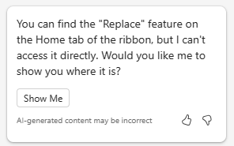

# 在 PowerPoint 中使用 Copilot 创建项目计划演示文稿
---
熟练使用 Copilot for PowerPoint 是 IT 专业人员的一项战略技能，旨在提升其演示文稿的影响力。 在企业界，通过引人注目的幻灯片进行有效沟通至关重要。 Copilot for PowerPoint 充当智能协作者，在 IT 专业人员制作演示文稿时提供实时建议和增强功能。 此工具不仅加快了创作过程，还确保内容引人入胜、清晰明了，并与预期受众产生共鸣。

IT 专业人员可能出于各种原因而需要创建 PowerPoint 演示文稿。 例如，他们可能需要：

 -  向团队或管理层展示他们的想法或建议。
 -  培训新员工或向客户演示新的软件或硬件。
 -  向非技术受众（例如利益干系人或投资者）解释复杂的技术概念。
 -  向潜在客户展示他们的工作或推广他们的服务。

借助 PowerPoint 中的 Copilot，可以基于现有 Word 文档创建演示文稿。 当你向 PowerPoint 中的 Copilot 提供你的 Word 文档的链接时，它可以生成幻灯片、应用布局并为你选择主题。

在前面的练习中，你创建了一个项目计划来安装网络安全产品。 然后，你要求 Copilot 分析网络安全产品的产品规格报告，并使用产品规格报告中的信息更新项目计划。

在本练习中，你将使用 PowerPoint 中的 Copilot 基于项目计划创建幻灯片演示文稿。 你希望使用此演示文稿向 IT 人员解释项目计划，并最终向公司管理层进行解释。

### 练习

作为 Adatum Corporation 的 IT 主管，你计划将 Contoso CipherGuard Sentinel X7 网络安全产品安装到 Adatum 的公司网络中。 在前面的练习中，你使用了 Microsoft Copilot 来创建安装项目计划。 现在，你希望使用 PowerPoint 中的 Copilot 基于该计划创建幻灯片演示文稿。 你必须向 IT 人员演示该项目计划，并最终向公司管理层演示。 执行以下步骤，创建你计划在演示文稿中使用的幻灯片组。

1.  如果你已完成上一练习并创建了 **Contoso CipherGuard project plan.docx** 文件，请确保将其复制到你的 OneDrive 帐户，然后继续执行下一步。 但是，如果你在上一练习中无法创建此项目计划，请选择以下链接，下载已为你创建的 [Contoso CipherGuard 项目计划](https://edxinteractivepage.blob.core.windows.net/ms-4004/Contoso%20CipherGuard%20project%20plan.docx)。 在文件下载完成后，将其复制到你的 OneDrive 帐户。
2.  此时，你应该有一个存储在 OneDrive 帐户中的 **Contoso CipherGuard project plan.docx** 文件。 打开该文件以确认一切正常，然后关闭文件。 这样做还可确保它显示在“最近使用(MRU)”文件列表中。
3.  如果你已在 Microsoft Edge 浏览器中打开了一个 Microsoft 365 标签页，则现在选择它；否则，请打开一个新标签页并输入以下 URL：**https://www.office.com**
4.  在 **Microsoft 365** 主页上，选择左侧导航窗格中的 **PowerPoint** 图标。
5.  在 **PowerPoint**中，打开一个新的空白演示文稿。
6.  选择功能区右侧的 **Copilot** 选项。
7.  在显示的 **Copilot** 窗格中，有多个预定义的提示可供你选择。 选择“基于文件创建演示文稿”提示。****
8.  在 **Copilot** 窗格底部的提示字段中，Copilot 会自动输入文本：**基于文件创建演示文稿 /**。正斜杠是指示要输入文件链接的通用 Copilot 指示符。 在这种情况下，它会触发 Copilot 打开“建议”窗口，其中显示三个最近使用的文件。****
     -  如果你的文件出现在此处，现在请选择它，然后继续执行下一步。
     -  如果该文件不是所显示的三者之一，请选择“建议”窗口右上角的向右箭头 (**&gt;**) 以查看展开的 MRU 文件列表。**** 如果该文件出现在此处，现在请选择它，然后继续执行下一步。
     -  如果你在展开的 MRU 列表中未看到文件，则必须复制报表链接并将其粘贴到提示字段中。 为此，请执行以下操作：
        1.  选择 **Microsoft 365** 浏览器标签页，然后在导航窗格中选择 **Word**。
        2.  在 **Word** 主页的最近文件列表中，选择该报表以在 Word 中将其打开。
        3.  在 Word 中的报表中，在功能区上方最右侧选择“共享”按钮。**** 在出现的下拉菜单中，选择“复制链接”。**** 等待“链接已复制”窗口出现，这确保了文件链接已被复制到剪贴板。****
        4.  切换到 **PowerPoint** 选项卡，在 **Copilot** 窗格底部，提示字段仍应显示**基于文件创建演示文稿 /**。 将光标置于正斜杠 (**/**) 之后，然后粘贴 (**Ctrl+V**) 报表链接。
9.  请注意文件在提示字段中的显示方式。 选择提示字段中的“发送”图标。****
10. 此提示触发了 Copilot 基于文档创建幻灯片演示文稿。 这样做时，它首先显示演示文稿的大纲。 然后，它显示一个单独的窗口，其中将显示它基于文档对演示文稿所做的一些更改的项目符号列表。
11. 现在，你可以自由查看幻灯片并进行任何必要的更新。 请特别注意 Copilot 根据文档所做的更改。 可以使用“设计器”工具调整布局。****
12. 查看 Copilot 添加到演示文稿中的演讲者备注。 验证它们是否指出了你在演示过程中要提出的要点。
13. 请注意，问答 (Q&A) 会话的末尾没有幻灯片。 要更正此疏忽，请输入以下提示：
    
    **在演示文稿末尾添加包含合适图像的 Q&A 幻灯片**。
14. 复查已创建的新幻灯片。 你不喜欢 Copilot 用于此幻灯片的图像，因此输入以下提示，要求 Copilot 更改图像：
    
    **我不喜欢你在 Q&A 幻灯片上使用的图像。请将其替换为其他图像**。
15. 你收到了什么响应？ 在我们为本练习进行的测试中，有时 Copilot 没有替换图像，并返回了以下消息。
    
       
         
      在测试期间的其他时间，此提示正常工作，Copilot 替换了幻灯片上的图像，并返回了以下消息。
         
      

 > [!TIP]
 > 请记住，该 Copilot 仍然是一个在制品，因此一些功能仍在完善中。 最佳做法是，如果 Copilot 无法完成你的请求，请重试。 如果它仍然不起作用，则尝试重新表述你的请求或将其一分为二。

16. 即使 Copilot 起作用并替换了你的图像，为了这次训练，让我们假设它没有起作用。 在本例中，让我们要求 Copilot 不仅替换图像，还要移除旧幻灯片，并将其替换为包含不同图像的全新幻灯片。 因此，请输入以下提示：
    
    **请移除 Q&A 幻灯片，并添加包含不同图像的一张新幻灯片**。
17. 你收到了什么响应？ 在我们为本练习进行的测试中，Copilot 持续移除了 Q&A 幻灯片，但它没有在其位置创建一张新幻灯片。 相反，它一直返回以下消息。
    
      
    
    
      尝试此提示时，Copilot 做出了怎样的响应？
      
      -  Copilot 是否按照你的要求移除了旧幻灯片并创建了一张包含不同图像的新幻灯片？ 如果是，那么恭喜你！
      -  或者，它移除了旧幻灯片，但没有创建新幻灯片？ 如果是这样，请要求它创建包含图像的新 Q&A 幻灯片。
      -  或者，它什么都没有做？ 如果是这样，请尝试将之前的最后一个提示一分为二：首先要求它移除 Q&A 幻灯片，然后提交第二个提示，要求它创建一张包含图像的新 Q&A 幻灯片。
    
 > [!TIP]
 > 如果 Copilot 没有按照你的要求进行操作，或者它返回了一个错误，那么这个场景就是使提示尽可能简单的一个很好的例子。 按照 Copilot 的建议，重新表述你的请求。 最好让 Copilot 一次执行一项任务，例如首先移除旧幻灯片，然后提交第二个请求，以添加包含图像的新幻灯片（在我们的测试中，对于每个请求，Copilot 始终使用不同的图像）。
18. 不管最后几步是如何处理 Q&A 幻灯片的，你都决定继续前进，尝试最后一件事。 在审阅演示文稿时，由于话题的技术性质，您决定将演示文稿的主题更改为更合适的主题。 输入以下提示：
    
 **将此演示文稿的主题更改为技术性更强的主题。**
19. 注意 Copilot 的响应。
    
   
    
    
此场景是需要牢记提示最佳做法的时刻之一：**了解 Copilot 的限制**。 在这种情况下，这并不是对限制的理解，而是对 Copilot 的工作原理的理解。 在这种情况下，Copilot 会将你指向现有的 PowerPoint 功能，而不是复制该功能的操作。

20. 本模块中剩余的培训练习不使用此演示文稿，所以你可以将其丢弃，也可以将其保存供将来参考。
