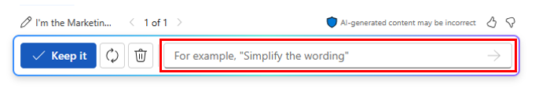

# 使用 Word 中的 Microsoft 365 Copilot 合并多个市场营销报告
---
Word 中的 Microsoft 365 Copilot 是一个 AI 支持的写作助手，可帮助营销专业人员更高效地创建文档。 在包含现有内容的文档中，Copilot 可以帮助你转换内容。 它可以重写所选内容，甚至可以将所选内容转换为表格。 Word 中的 Microsoft 365 Copilot 可以帮助营销专业人员在创建文档时节省时间和精力。 它可以帮助你生成内容、重写文本，以及提供有用的建议。 凭借其 AI 支持的写作功能，Copilot 可以帮助你更高效地创建文档。

Word 中的 Microsoft 365 Copilot 可以通过多种方式帮助营销专业人员，例如：

 -  **创建引人入胜的内容**。 Word 中的 Microsoft 365 Copilot 可以帮助营销专业人员为其博客和社交媒体创建引人入胜的内容。
 -  **分析客户反馈**。 Word 中的 Microsoft 365 Copilot 可帮助营销专业人员分析客户反馈和参与数据，以确定趋势并获得见解。 他们可以使用此信息定制未来的营销策略，从而提高在线参与度和客户覆盖率。
 -  **生成营销报告**。 Word 中的 Microsoft 365 Copilot 可以帮助营销专业人员生成营销活动报告，包括有关客户参与度、转换率和投资回报率 (ROI) 的数据。
 -  **优化电子邮件通信**。 Word 中的 Microsoft 365 Copilot 可以帮助市场营销专业人员优化其电子邮件回复和制定客户参与策略，确保及时有效的沟通。
 -  **准备会议议程**。 Word 中的 Microsoft 365 Copilot 可以帮助营销专业人员准备会议议程，确保所有重要主题均都涉及，使会议富有成效和以结果为导向。

在本练习中，你将使用 Word 中的 Microsoft 365 Copilot 将三个单独的报告合并为一个报告，以创建单个报告。 然后通过 Copilot 使用其他信息修改报告。

使用 Word 中的 Microsoft 365 Copilot 生成新文档时，会创建文档草稿。 如果请求 Copilot 添加或更改文档中的内容，则会重新生成应用了更改的新文档草稿。 你继续在 Copilot 草稿模式下工作，其中 Copilot 会为你进行所有请求的更改。 对最新草稿感到满意后，选择“保留”按钮****。 这样做会将文档从 Copilot 草稿更改为 Word 文档。 如果尝试在草稿模式下手动更改任何内容，Copilot 窗口就会消失。 虽然可以在 Word 功能区上选择 Copilot 图标以打开 Copilot 窗格，但“重新生成”选项不可用，因为你不再在 Copilot 草稿模式下工作****。

### 练习

作为 Contoso 有限公司 Contoso 饮料部的拉丁美洲 (LATAM) 营销总监，你的产品经理向你提供了涉及公司的神秘香料高级印度奶茶饮料的三份不同的报告。 但你发现很难分析信息，因为你经常在文档之间来回切换。

你决定使用 Word 中的 Microsoft 365 Copilot，将这些报告合并成一份神秘香料臻品印度奶茶的 LATAM 市场分析报告。 Copilot 创建此报告后，你想要查看它，并可能使用 Copilot 可以在拉丁美洲的印度奶茶市场找到的其他信息更新它。

执行以下步骤，使用 Word 中的 Microsoft 365 Copilot 创建此市场分析报告：

1.  选择以下链接，下载[神秘香料高级印度奶茶产品说明](https://go.microsoft.com/fwlink/?linkid=2268929)的副本。
2.  选择以下链接以下载 [Contoso 印度奶茶市场 2023 年趋势](https://go.microsoft.com/fwlink/?linkid=2269122)的副本。
3.  选择以下链接，下载[拉丁美洲印度奶茶促销计划](https://go.microsoft.com/fwlink/?linkid=2269126)的副本。
4.  下载完成后，打开“文件资源管理器”，并将文件从 Downloads 文件夹移动到 OneDrive 帐户中的一个文件夹********。
5.  在本练习中，你将访问“最近使用(MRU)”文件列表中的文档。 若要使文件显示在 MRU 列表中，请打开并关闭 OneDrive 帐户中这三个文件中的每一个。
6.  在 Microsoft 365 中，打开 Microsoft Word，然后打开一个新的空白文档********。
7.  在空白文档顶部显示的“使用 Copilot 起草”窗口中，输入以下提示，但在将三个文件链接到提示之后，才选择“生成”按钮********：
    
    **我是 Contoso 饮料部的 LATAM 营销总监。请为我们的神秘香料高级印度奶茶饮料创建 LATAM 市场分析报告。请合并这三个附加文件以创建一个报告，该报告将描述该产品，分析其市场趋势，并包含拉丁美洲的促销计划**。
8.  现在必须将这三个文档附加到提示。 在“使用 Copilot 起草”窗口中，选择“引用你的内容”按钮********。 在显示的下拉菜单中，如果“神秘香料高级印度奶茶产品说明.docx”文件显示在文件列表中，请选择它****。 否则，选择“浏览云中的文件”，从“最近”文件列表中选择该文件，然后选择“附加”按钮************。 请注意文件在提示中的显示方式。
9.  对“Contoso 印度奶茶市场 2023 年趋势.xlsx”文件和“拉丁美洲印度奶茶促销计划.docx”文件重复上述步骤********。 此时，所有三个文件的链接都应显示在提示中。
10. 选择**生成**。 这样做后，Copilot 会从这三个文件中提取相关信息，并起草一份报告，将这些文件合并为一个神秘香料高级印度奶茶市场分析报告。
11. 在查看市场分析报告的第一个草稿后，你意识到它缺少一些关键信息。 你希望看到它添加标题为“竞争分析”的章节****。 你想让 Copilot 分析竞争情况。 为此，请在报告底部的 Copilot 窗口中输入以下提示，然后选择“生成”箭头****：
    
    
    
    
    **此报告看起来不错。但请添加标题为“竞争分析”的章节。综述拉丁美洲销售印度奶茶的饮料公司，然后在本节中提供有关这些竞争对手的优劣势、市场份额和定价策略的信息**。
12. 查看包含新的“竞争分析”章节的报告的第二份草稿后，你意识到还缺少最后一个内容。 你希望 Copilot 添加一个介绍“分销渠道”的章节****。 本章节应分析用于在拉丁美洲销售印度奶茶的分销渠道。 为此，请在报告底部的 Copilot 窗口中输入以下提示，然后选择“生成”箭头****：
    
    **做得不错！最后一件事。请添加标题为“分销渠道”的章节。综述在拉丁美洲销售印度奶茶所用的分销渠道，然后在本节中提供有关所用零售商、批发商和分销商类型的信息**。
13. 查看包含新的“分销渠道”章节的最新草稿后，你对该报告感到满意，可以保存该报告。 在文档底部的 Copilot 窗口中，选择“保留”按钮，将其从 Copilot 草稿转换为 Word 文档****。
14. 查看文档。 如果想要进行任何手动更改，现在可以执行此操作。 对文档感到满意后，如果希望保留该文档以供将来参考，请随时将其保存到 OneDrive，否则放弃该文档即可。
15. 在 Microsoft Edge 浏览器中关闭此标签页。
