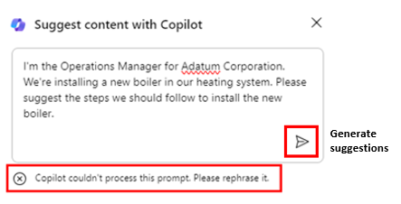

# 在 Whiteboard 中使用 Copilot 的头脑风暴项目计划想法
---
Microsoft Whiteboard 是一款数字画布，允许用户实时协作、集思广益和轻松创建内容。 这是一款通用工具，业务专业人员可将其用于各种目的，如项目管理、设计思维和教育。 Whiteboard 的功能包括自由绘图、便笺和模板，你可以根据自己的需求自定义这些功能。

运营经理可以通过多种方式从 Microsoft Whiteboard 中受益。 Whiteboard 允许多个用户在数字空间中同时工作，因此可以轻松共享视觉对象和想法，有助于促进协作。 它还为项目、集思广益、研讨会、回顾总结、设计、战略规划以及解决可能有动态变化部分或需要更多视觉效果的问题提供了一个空间。 Whiteboard 提供涂鸦空间、共享原型草图或编纂产品名称创意列表，以帮助提高工作效率。

在本练习中，你将担任运营经理一职，希望将新锅炉安装到建筑物的加热系统中。 你的长期目标是为安装过程制定项目计划。 你希望使用 Whiteboard 中的 Copilot 来建议完成此类安装所需的步骤。 将此练习视为 AI 辅助的便笺练习。

你是否曾参加过使用便笺的集思广益会议？ 会议与会者在便笺上写下想法，然后将其贴在白板或墙上。 然后，会议主持人重新整理便笺，将其分为不同的类别，删除重复的想法，编辑想法以求表述清晰，等等。 完成会议后，最终会获得分门别类的一堆想法。

这就是本练习的真正目的：在 Whiteboard 中的 Copilot 的帮助下，完成一个虚拟化的便笺练习。 然而，在本例中，没有满屋子的人在集思广益并在便笺上写下想法，而是由 Copilot 取而代之。 观看 Copilot 如何产生一系列想法，在图形便笺上写下每个想法，然后将便笺贴到 Whiteboard 画布上。 作为会议主持人，你可以编辑和删除任何便笺。 然后，随着便笺的最终列表粘贴到位，你将让 Copilot 将便笺整理成各种类别。 这样做有助于将来归档，并帮助确保在制定项目计划时不会忽略任何便笺。

### 练习

作为 Adatum Corporation 的运营经理，你正计划将新锅炉安装到建筑物的加热系统中。 但在开始安装过程之前，你想要使用 Whiteboard 中的 Copilot 来建议公司更新加热系统时通常可能需要完成的步骤。 然后，让 Copilot 对所有建议进行分类，以便更轻松地查找相关想法并将其组合在一起。 以这种方式使用 Whiteboard 中的 Copilot 有助于促进你计划将来与团队进行涉及安装过程的讨论。

1.  在 Microsoft Edge 浏览器中，打开一个新标签页，并输入以下 URL 转到 Microsoft 365 主页：**https://www.office.com**
2.  在 Microsoft 365 主页上，如果左侧导航窗格中显示“Whiteboard”图标，则立即选择它，然后继续执行下一步********。 否则，请选择“应用”图标，然后在“应用”页上向下滚动到“按类别浏览”部分，然后在“生产力”选项卡（默认情况下应显示）中，选择“Whiteboard”********************。
3.  登录到 Microsoft Whiteboard****。
4.  在 Whiteboard 主页上，选择“新建白板”********。
5.  在页面顶部的功能区上，选择“白板”下拉箭头****。 在“白板名称”字段中，输入“锅炉安装项目计划”，然后选中复选标记图标********。

 
    
7.  如果出现“使用 Copilot 建议内容”窗口，则继续执行下一步****。 否则，在页面底部任务栏上方显示的图标托盘中，选择“Copilot”图标****。 在出现的菜单中，选择“建议”****。
8.  在“使用 Copilot 建议内容”窗口中，输入以下提示****：
    
    **我是 Adatum Corporation 的运营经理。我们正在加热系统中安装一个新的锅炉。请建议安装新锅炉时应遵循的步骤。**
9.  如果出现“使用 Copilot 建议内容”窗口，则继续执行下一步****。 但如果收到一条消息，指出“出现问题。**** 请重试。” 或“Copilot 无法处理此提示。**** 请重新表述。” 然后选择 Copilot 窗口下部边角的“生成建议”箭头****。
    
    
    
    
    有时，Copilot 已完成它正在处理的过程，但会停顿片刻才显示结果。 再次选择“生成建议”箭头时，通常会不怎么延迟地显示结果****。 但如果第二次收到类似的消息，则再选择“生成建议”箭头几次****。 如果在三次或四次尝试后继续收到此错误，则输入以下文本来简化提示：
    
    **请建议我们在建筑的加热系统中安装新锅炉应遵循的步骤**。
10.  默认情况下，Copilot 会生成六个一组的想法。 在出现的“使用 Copilot 建议内容”窗口中，记下它生成的前六个想法****。 Copilot 在此处提供了两个选项：如果你对建议感到满意，则可以将想法粘贴到白板，或者可以让 Copilot 生成更多建议。 请注意“插入(6)”按钮如何指示 Copilot 生成的想法个数 - 在本例中为 6****。 虽然六个建议作为最少建议数很不错，但如果想要深入了解安装安全产品所需的任务，因此请选择“生成更多”按钮****。

    > [!NOTE]
    > 如果 Copilot 显示了任何类型的错误消息，则再次选择“生成更多”按钮****。 请在每次收到错误消息时执行此操作。 
    
12. 请注意 Copilot 如何生成另外 6 个想法，因此“插入(12)”按钮现在显示“12”********。 虽然可以不断生成更多想法，但为了节省时间，让我们插入当前呈现的 12 个想法。 选择“插入(12)”按钮****。
13. 选择“插入”按钮时，Copilot 会以黄色便笺的形式将建议的想法粘贴到白板****。 与使用实际便笺的现实集思广益会议一样，可以编辑特定便笺、删除便笺、锁定便笺以防将来删除，等等。 在 Microsoft Whiteboard 中，通过标准白板功能支持这些活动。
    
    如果以前从未使用过 Whiteboard，请尝试选择（双击）特定便笺，然后在上面显示的菜单栏中，可以选择“编辑文本”（铅笔）图标或任何其他选项****。 选择菜单栏末尾的省略号图标会显示更多选项的菜单，例如删除便笺。 同样，Microsoft Whiteboard 背后的想法是模拟现实世界的便笺练习。 可以根据需要随时编辑便笺。
14. 在查看建议的想法时，你觉得它们没有充分涵盖风险缓解措施。 在页面底部选择“Copilot”图标，然后从菜单中选择“建议”********。
15. 在出现的“使用 Copilot 建议内容”窗口中，输入以下提示以生成有关风险缓解的更多想法****：
    
    **请建议一些方法来缓解在建筑物供热系统中安装新锅炉的风险**。
16. 查看 Copilot 建议的六个想法。 如果希望 Copilot 包含更多详细信息，请选择“生成更多”按钮****。
17. 如果对 12 个风险缓解想法感到满意，请选择“插入(12)”按钮****。 请注意如何选择包含 12 个风险缓解想法的图块（请参阅外部边界）。 如果 Copilot 将 12 个风险缓解想法部分覆盖了原始的 12 个项目计划想法，则可以选择此想法图块，并将其移动到屏幕上，以便它不再覆盖原始的 12 个想法。 不要担心这两个图块的排列问题。 在后面的步骤中将便笺分类整理后，它们看起来就很美观了。 现在，只需将每个图块摆放整齐，即可查看所有想法。 这样做可提供查看 Copilot 建议的区域所需的可见性，以便可以根据需要编辑其中任何区域。
18. 现在，你对 Copilot 创建的建议感到满意，并且已完成想要对便笺所做的所有编辑。 你现在希望 Copilot 按类别整理便笺。 Copilot 会确定类别的名称，然后相应地自动整理便笺。 在页面底部选择“Copilot”图标，然后从菜单中选择“分类”********。
19. 请注意发生的情况。 Copilot 生成了一组类别，并相应地重新整理便笺。 每个类别的便笺分配了不同的颜色，以帮助识别类别之间的差异。 如果包含便笺的矩形大小未达到上限，但仍适合屏幕，请选择页面右下角的“适应屏幕”图标****。 这样做会增加图像的大小，直到它无法再增加，且不会超过屏幕大小。
20. 记下经过整理的便笺组下方显示的图标托盘。 如果对类别不满意，请在显示的图标托盘上选择“重新生成”按钮****。
    
    > [!NOTE]
    > 可以根据需要多次选择“重新生成”按钮，直到对 Copilot 提供的类别感到满意****。 多次选择此按钮，并记下 Copilot 每次所做的更改。 除了更改类别名称外，Copilot 还可以增加或减少每次重新生成的类别数。

21. 多次重新生成类别后，你意识到缺少有关最大限度减少系统停机时间的详细步骤。 你想让 Copilot 在白板会议中就此问题添加更多想法。 此外，还确定了要删除的便笺。 但是，由于你已经整理了想法，因此必须在对便笺进行分类之前将白板会议更改回编辑模式。 为此，请选择“还原”按钮****。
22. 回到编辑模式后，选择不再需要的便笺，然后在出现的图标托盘中选择省略号图标。 从显示的菜单中选择“删除”****。
23. 若要让 Copilot 生成更多想法，请在页面底部选择“Copilot”图标，然后从菜单中选择“建议”********。
24. 在出现的“使用 Copilot 建议内容”窗口中，输入以下提示以生成有关最大限度减少系统停机时间的更多想法****：
    
    **请建议在安装新锅炉时限制加热系统停机时间的方法**。
25. 查看 Copilot 建议的六个想法。 如果对这些想法感到满意，请选择“插入(6)”按钮****。
26. 请注意，包含六个便笺的图块周围已用线条突出显示。 此便笺图块称为便笺网格。 可以像白板上的任何其他元素一样移动便笺网格，或调整其大小。 调整便笺网格的大小时，其内所有便笺的大小会相应地调整。 如果包含六个便笺的图块覆盖在某一个便笺图块顶部，请选择便笺网格外的一条线，将包含六个便笺的整个图块拖动到一侧，以便它不会覆盖上述任何便笺。 如果屏幕上的空间已用完，图块的一部分会从屏幕中消失，请选择页面右下角的“适应屏幕”图标****。
27. 你已准备好让 Copilot 整理便笺，其中包括 18 个便笺 - 一个包含 12 个便笺的图块和一个包含 6 个便笺的图块。 在页面底部选择“Copilot”图标，然后从菜单中选择“分类”********。 在“将所选便笺分类”窗口中，选择“分类”按钮********。
28. 有时，包含便笺的矩形的大小未达到其上限，在画布周围留出了空白区域。 在这种情况下，便笺的文本大小通常较小且难以阅读。 如果出现此大小调整问题，请选择页面右下角的“适应屏幕”图标****。 这样做会增加图像的大小。 如果继续选择此按钮，它最终会达到某个程度，在这个程度它无法再增加矩形的大小，但不会超过屏幕大小。 对此图标的任何进一步选择都不会影响矩形。
29. 查看类别。 在矩形下方显示的 Copilot 图标托盘中，可以选择“重新生成”按钮以创建新的类别集****。 事实上，多次选择“重新生成”按钮可查看类别的变化****。 对结果感到满意后，选择“保留结果”按钮****。
30. 请注意，每个类别的便笺采用不同的颜色。 你意识到你想要将集思广益会议的简短摘要添加到白板内容。 为此，请在页面底部选择“Copilot”图标，然后从菜单中选择“汇总”********。 Copilot 根据此白板会议生成主要主题的简短摘要。 向下滚动以查看整个“摘要”窗口****。 你对结果感到满意，因此请选择“保留结果”****。
31. 选择页面右下角的“适应屏幕”图标，将所有便笺和会议摘要填充整个屏幕****。
